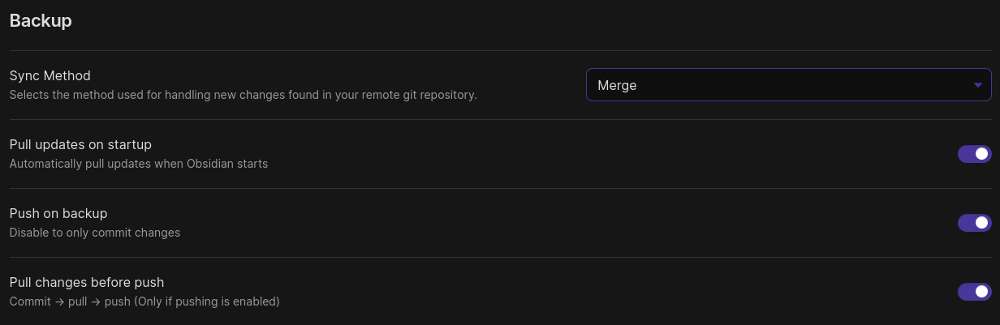
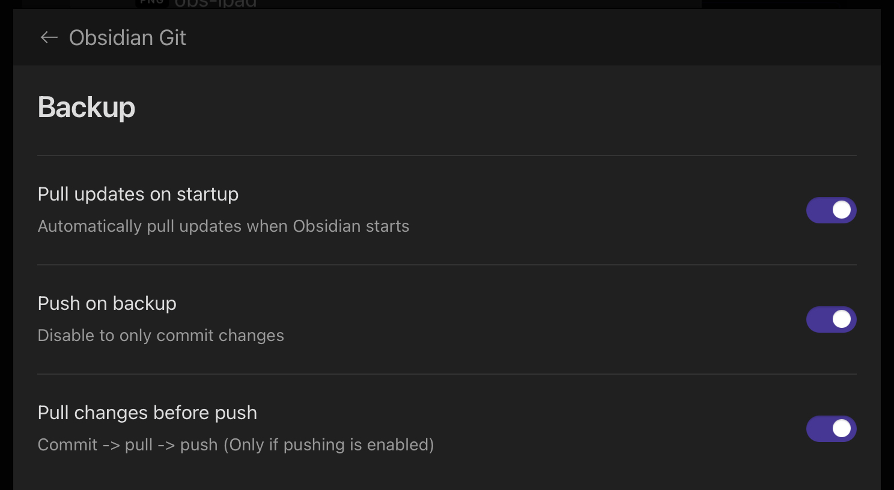
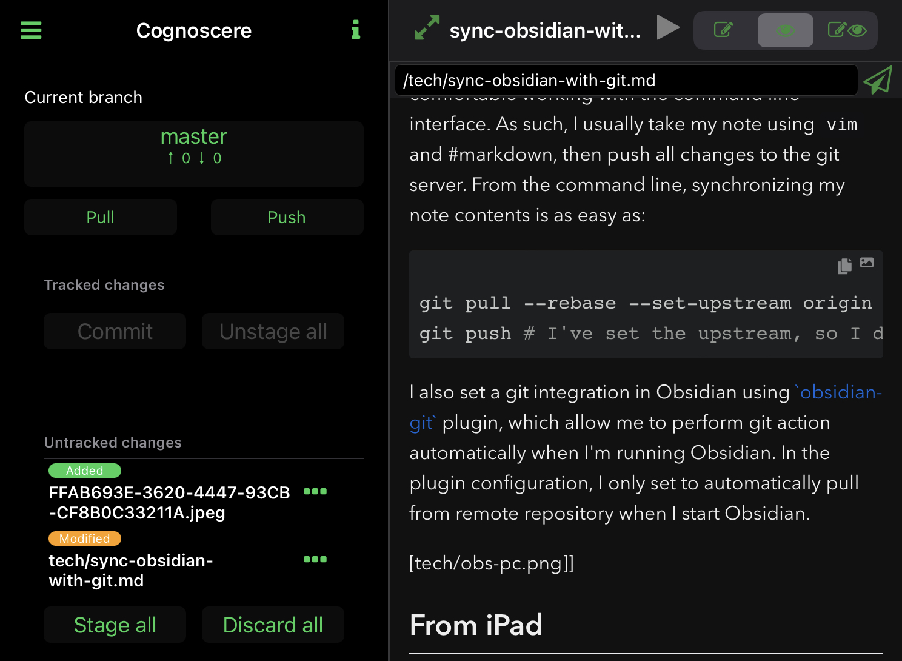

# What do I want to achieve?

As a user, I want to have a decentralized and personal knowledge base. In an ideal workflow, I can update my  knowledge base asynchronously from *any* device then periodically sync them, either automatically or manually. Throughout the years, I enjoy writing my notes using #markdown syntax, as it is highly versatile and convertible to other formats. Naturally, I would love to incorporate my usual workflow using #markdown to create my personal knowledge base. My previous solution was to create a [static website](https://lamurian.rbind.io) using #hugo, so that I can keep all my notes in #markdown. To my regret though, it is rather difficult to incorporate this workflow in a mobile setting. I require a more dynamic solution, where I can use my phone/tablet to quickly jot down my ideas then process it later on my PC.

# How far do I get with Obsidian?

Obsidian solve some hassles for me, as it provides me a cross-platform text editor which I can synchronize using `git`. However, so far I haven't been able to resolve the `git push` error in [`obsidian-git`](https://github.com/denolehov/obsidian-git) plugin when I push from mobile devices. I understand there are caveats in using git from mobile devices, and it is still the most suitable solution at the moment. Although I'm unable to sync from my phone/tablet, at least I know there's a possibility that this might be feasible in the future. Furthermore, there's an interesting plugin where I can possibly convert Obsidian #markdown to #hugo format, which I will delve further in a different post.

# Synchronizing

## From PC

When I'm using PC, I always find myself rather comfortable working with the command line interface. As such, I usually take my note using `vim` and #markdown, then push all changes to the git server. From the command line, synchronizing my note contents is as easy as:

```bash
git pull --rebase --set-upstream origin master # To pull from the remote server
git push # I've set the upstream, so I don't need to specify `origin` nor `master`
```

I also set a git integration in Obsidian using [`obsidian-git`](https://github.com/denolehov/obsidian-git) plugin, which allow me to perform git action automatically when I'm running Obsidian. In the plugin configuration, I only set to automatically pull from remote repository when I start Obsidian.



## From iPad

Synchronizing from iPad is a different story though, because I need two applications to push and pull the notes. Pulling the note is done automatically every time I launch Obsidian, however, due to some strange occurrences, I'm unable to push my changes from Obsidian. Everytime I push, it always cough up an error saying that authentication failed. As a solution, I'm currently using [MarkGit](https://apps.apple.com/us/app/markgit/id1576100771). Other people and Obsidian help document mentioned that [Working Copy](https://apps.apple.com/us/app/working-copy-git-client/id896694807) also *works* (bad pun intended). My only reason to use MarkGit is because it's way more affordable compared to other git client options in the app store. To be noted though, you might encounter error with your credentials when using this application. Give it a week or two and the developer will solve the issue in the next update (it's working fine as of 11 Oct 2022).



